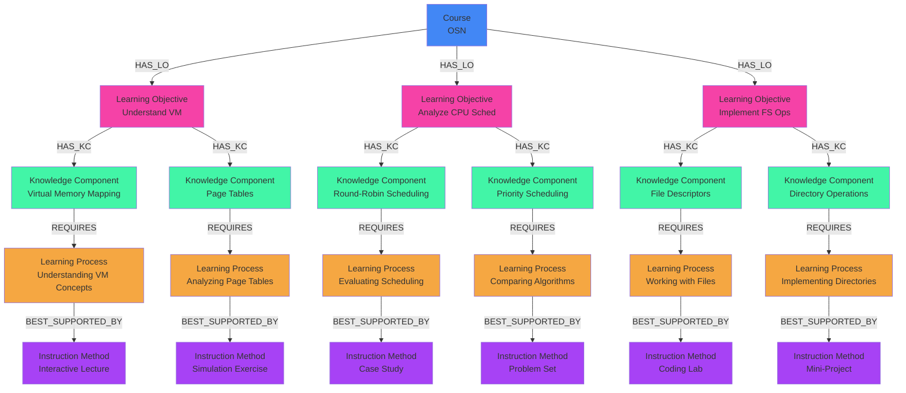

# 🎓 LangGraph Knowledge Graph System
### Production-Ready Educational Technology Platform

A sophisticated **educational technology platform** that combines **microservices architecture**, **multi-agent orchestration**, and **adaptive learning** to transform academic content into personalized educational experiences. Built with faculty governance and production-ready infrastructure.

## 🌟 Features

- **Production Microservices**: 8 independent services with Universal Orchestrator
- **Advanced LLM Gateway**: Multi-provider adapter system (OpenAI, Anthropic, Ollama)
- **Faculty Workflow**: 3-tier approval system for academic quality assurance
- **Adaptive Learning Engine**: Decision tree-based learner classification and routing
- **Complete Infrastructure**: 12 specialized database containers with automated setup
- **Personalized Learning Trees (PLT)**: Individual learning paths based on learner profiles
- **Knowledge Graph Technology**: Neo4j integration with complex educational relationships
- **Repository Optimization**: 37% token reduction for AI-assisted development

## 🏗️ Production Architecture

### System Overview
```
┌─────────────────────────────────────────────────────────────┐
│                 Universal Orchestrator                      │
│              (LangGraph Multi-Agent System)                 │
└─────────────────────────────────────────────────────────────┘
                              │
        ┌─────────────────────┼─────────────────────┐
        │                     │                     │
┌───────▼───────┐    ┌───────▼───────┐    ┌───────▼───────┐
│    Content    │    │    Learner    │    │  SME/Analytics │
│  Subsystem    │    │  Subsystem    │    │  (Ready)       │
│  (5 services) │    │  (3 services) │    │               │
└───────────────┘    └───────────────┘    └───────────────┘
```

### Microservices Architecture (8 Services)

#### Content Processing Pipeline (Sequential Flow)
1. **Course Manager** → Faculty input & LLM course outline → Faculty approval
2. **Content Preprocessor** → Document processing → Structured chunks  
3. **Course Mapper** → Learning objectives extraction (5 LangGraph agents)
4. **KLI Application** → Learning processes identification (2 agents)
5. **Knowledge Graph Generator** → Neo4j knowledge graph creation

#### Learner Personalization Pipeline
1. **Query Strategy Manager** → Adaptive learner classification & routing
2. **Learning Tree Handler** → PLT generation (6 LangGraph agents) 
3. **Graph Query Engine** → Neo4j query execution & recommendations

### Faculty Governance Workflow
```
Faculty Input → Course Manager → LLM Course Outline → Faculty Approval → 
Document Upload → Content Preprocessor → 5-Agent Processing → 
Faculty Confirmation → Knowledge Graph → Faculty Finalization → 
Learner PLT Request → Personalized Learning Tree
```

## 📦 Production Installation

### 1. **Clone the Repository**
```bash
git clone https://github.com/Deepesh-vendoti/LMW-KG.git
cd LMW-KG
```

### 2. **Setup Production Infrastructure**
```bash
# Start all 12 database containers
chmod +x deployment/setup-databases.sh
./deployment/setup-databases.sh

# Verify 100% database connectivity
python test_database_connections.py
```

### 3. **Install Dependencies & Configure**
```bash
# Create Python environment
python -m venv venv
source venv/bin/activate  # On Windows: venv\Scripts\activate

# Install production dependencies
pip install -r requirements.txt

# Configure LLM providers (optional)
# Edit config/config.yaml for OpenAI/Anthropic API keys
```

### 4. **Start the System**
```bash
# Start Universal Orchestrator
python main.py

# Test complete pipeline
python -c "
from orchestrator.universal_orchestrator import UniversalOrchestrator
orchestrator = UniversalOrchestrator()
result = orchestrator.process_content('Advanced operating systems concepts')
print('✅ Production system operational:', result)
"
```

## 🗄️ Database Infrastructure (12 Containers)

### Production Database Architecture
- **Neo4j (2 instances)**: Primary & secondary knowledge graphs
- **MongoDB (2 instances)**: Course data & system configuration  
- **PostgreSQL (5 instances)**: Microservice-specific databases
  - Course Manager DB, Content Preprocessor DB, Course Mapper DB
  - KLI Application DB, Learning Tree Handler DB
- **Redis**: Caching & session management
- **Elasticsearch**: Content search & indexing
- **Adminer**: Database administration interface

### LMW-MVP Container Naming
All database containers follow the LMW-MVP naming convention for production deployment with standardized networking and volume management.

## 🚀 Production Usage

### Faculty-Driven Course Creation Workflow
```bash
# 1. Faculty initiates course with Course Manager
python -c "
from subsystems.content.services.course_manager import CourseManager
manager = CourseManager()
result = manager.initialize_course('Operating Systems', 'faculty_123')
print('✅ Course initialized:', result)
"

# 2. Content processing pipeline (automatic after faculty approval)
python -c "
from orchestrator.universal_orchestrator import UniversalOrchestrator
orchestrator = UniversalOrchestrator()
result = orchestrator.process_content_pipeline('course_id_123')
print('✅ Content processed:', result)
"
```

### Learner Personalization Workflow  
```bash
# Generate personalized learning tree for specific learner
python -c "
from subsystems.learner.services.learning_tree_handler import LearningTreeHandler
handler = LearningTreeHandler()
result = handler.generate_plt('learner_R000', 'course_OSN')
print('✅ PLT generated:', result)
"

# Query adaptive learning recommendations
python -c "
from subsystems.learner.services.query_strategy_manager import QueryStrategyManager
manager = QueryStrategyManager()
strategy = manager.determine_strategy('learner_R000', {'score': 6, 'attempts': 3})
print('✅ Learning strategy:', strategy)
"
```

### LLM Gateway Integration
```bash
# Test multi-provider LLM gateway
python -c "
from utils.llm_gateway_adapter import LLMGatewayAdapter
adapter = LLMGatewayAdapter()
result = adapter.generate_content('Explain process scheduling', task_type='educational_content')
print('✅ LLM Gateway working:', result[:100])
"
```

### Database & System Verification
```bash
# Verify all 12 database containers
python test_database_connections.py

# Test complete end-to-end pipeline
python test_universal_orchestrator.py

# Integration test with Elasticsearch
python test_es_integration.py
```

## 📊 Knowledge Graph Schema

### Nodes
- `(:Course {id, name})`
- `(:LearningObjective {id, text})`
- `(:KnowledgeComponent {id, text})`
- `(:LearningProcess {id, type})`
- `(:InstructionMethod {id, description, type})`
- `(:Resource {resource_id, name, type, format, difficulty, url, title})`
- `(:PersonalizedLearningStep {learner_id, course_id, lo, kc, priority, sequence, instruction_method})`

### Relationships
- `(:Course)-[:HAS_LO]->(:LearningObjective)`
- `(:LearningObjective)-[:HAS_KC]->(:KnowledgeComponent)`
- `(:KnowledgeComponent)-[:DELIVERED_BY]->(:InstructionMethod)`
- `(:InstructionMethod)-[:USES_RESOURCE]->(:Resource)`
- `(:KnowledgeComponent)-[:REQUIRES]->(:LearningProcess)`
- `(:LearningProcess)-[:BEST_SUPPORTED_BY]->(:InstructionMethod)`

## 📊 Knowledge Graph Visualization

The system provides a simple knowledge graph generator microservice:

```bash
# Generate and visualize a knowledge graph with default settings
python main.py kg

# Generate and visualize a knowledge graph for a specific course
python main.py kg --course_id OSN

# Clear existing data before generation
python main.py kg --clear_existing

# Specify an output file for the visualization
python main.py kg --output my_graph.md
```

The knowledge graph generator automatically:
1. Generates a knowledge graph for the specified course
2. Stores it in Neo4j
3. Visualizes it using the best available option:
   - Matplotlib visualization (if GUI is available)
   - Mermaid diagram saved to a file (fallback option)

The knowledge graph visualization shows the relationships between:
- Courses
- Learning Objectives
- Knowledge Components
- Learning Processes
- Instruction Methods
- Resources

### Knowledge Graph Structure



## 🧪 Testing

### Core Functionality Tests
- `test_plt_clean.py`: PLT generation and Neo4j insertion
- `test_generate_plt.py`: PLT generation workflow
- `test_insert_os_data.py`: Knowledge graph insertion
- `test_es_integration.py`: ES integration functionality

### Database Functions
- `insert_plt_to_neo4j()`: Insert personalized learning trees
- `insert_course_kg_to_neo4j()`: Insert course-level knowledge graphs
- `get_plt_for_learner()`: Query personalized learning data
- `get_kcs_under_lo()`: Query knowledge components under learning objectives

## 📁 Production Project Structure

```
LMW-KG/
├── 📂 orchestrator/                    # Universal Orchestration Layer
│   ├── universal_orchestrator.py       # LangGraph multi-agent coordinator
│   ├── service_registry.py            # Dynamic microservice discovery
│   ├── approval_states.py             # Faculty approval workflow states
│   └── state.py                       # Universal state management
│
├── 📂 subsystems/                      # Microservices Architecture
│   ├── 📂 content/                    # Content Processing Subsystem (5 services)
│   │   └── 📂 services/
│   │       ├── course_manager.py       # 🥇 FIRST: Course initialization & faculty workflow
│   │       ├── content_preprocessor.py # Content processing & chunking
│   │       ├── course_mapper.py        # LO+KC generation (5 agents)
│   │       ├── kli_application.py      # LP+IM identification (2 agents)  
│   │       └── knowledge_graph_generator.py # Neo4j KG creation
│   │
│   └── 📂 learner/                    # Learner Processing Subsystem (3 services)
│       └── 📂 services/
│           ├── query_strategy_manager.py # Adaptive learner classification
│           ├── learning_tree_handler.py  # PLT generation (6 agents)
│           └── graph_query_engine.py     # Neo4j query execution
│
├── 📂 utils/                          # Production Utilities
│   ├── llm_gateway_adapter.py         # Multi-provider LLM gateway (669 lines)
│   ├── database_manager.py            # 12-database connection management
│   └── logging.py                     # Performance tracking & monitoring
│
├── 📂 graph/                          # Core LangGraph Components
│   ├── agents.py                      # Content processing agents (7 agents)
│   ├── agents_plt.py                  # PLT generation agents (6 agents) 
│   ├── db.py                         # Neo4j database functions
│   ├── graph.py                      # LangGraph pipeline definitions
│   └── plt_generator.py              # PLT generation orchestrator
│
├── 📂 config/                         # Configuration Management
│   ├── config.yaml                   # System configuration
│   ├── database_connections.yaml     # 12-database connection settings
│   ├── database_architecture.yaml    # Database schemas & relationships
│   └── init-*.sql|.cypher|.js       # Database initialization scripts
│
├── 📂 pipeline/                       # Pipeline Coordination
│   ├── coordinator.py                # Automatic pipeline coordination
│   └── semi_automatic_coordinator.py # Faculty approval workflow
│
├── 🔧 Production Files
├── deployment/docker-compose-databases.yml      # 12 database container orchestration
├── deployment/setup-databases.sh               # Automated database infrastructure setup
├── test_database_connections.py     # 100% connectivity verification
├── main.py                          # Universal Orchestrator CLI
└── requirements.txt                 # Production dependencies
```

### Key Architecture Principles

- **Course Manager First**: Faculty-driven workflow starts with Course Manager
- **Sequential Processing**: Content → Learner subsystem coordination  
- **Universal Orchestration**: Cross-subsystem state management
- **Database Specialization**: Each microservice has dedicated database
- **LLM Gateway Abstraction**: Unified interface for multiple providers

## 🔧 Production Configuration

### LLM Gateway Configuration
```yaml
# config/config.yaml
llm_providers:
  openai:
    api_key: "${OPENAI_API_KEY}"
    models: ["gpt-4", "gpt-3.5-turbo"]
  anthropic:  
    api_key: "${ANTHROPIC_API_KEY}"
    models: ["claude-3-opus", "claude-3-sonnet"]
  ollama:
    endpoint: "http://localhost:11434"
    models: ["qwen2.5:4b", "llama3:8b"]
```

### Database Configuration (12 Containers)
```yaml
# config/database_connections.yaml  
databases:
  neo4j_primary: "bolt://localhost:7687"
  neo4j_secondary: "bolt://localhost:7688"
  mongodb_course: "mongodb://localhost:27017/course_data"
  mongodb_system: "mongodb://localhost:27018/system_config"
  postgres_course_manager: "postgresql://localhost:5432/course_manager"
  postgres_content_preprocessor: "postgresql://localhost:5433/content_prep"
  # ... 5 PostgreSQL instances total
  redis: "redis://localhost:6379"
  elasticsearch: "http://localhost:9200"
  adminer: "http://localhost:8080"
```

### Faculty Approval Configuration
```yaml
# Approval workflow settings
approval_stages:
  FACD: "Faculty Approves Course Design"
  FCCS: "Faculty Confirms Content Structure" 
  FFCS: "Faculty Finalizes Course Specification"
```

## 📈 Production System Output Examples

### Course Manager Initialization
```bash
� Course Manager - Faculty-Driven Course Creation
==================================================
✅ Course initialized: Operating Systems (ID: course_123)
🧑‍🏫 Faculty: Dr. Smith (faculty_123)
📋 LLM Course Outline: Generated with 12 learning objectives
⏳ Status: FACD (Faculty Approves Course Design) - Pending Approval
```

### Microservices Pipeline Execution
```bash
� Universal Orchestrator - Production Pipeline
===============================================
1️⃣ Course Manager: ✅ Faculty approval received
2️⃣ Content Preprocessor: ✅ 150 chunks processed
3️⃣ Course Mapper: ✅ 25 learning objectives + 150 knowledge components 
4️⃣ KLI Application: ✅ Learning processes identified
5️⃣ Knowledge Graph Generator: ✅ Neo4j graph created

� Pipeline completed in 45 seconds
🎯 Ready for learner personalization
```

### Adaptive Learning Classification
```bash
🧠 Query Strategy Manager - Learner Classification
================================================
� Learner: R000 (Score: 6, Attempts: 3, Confusion: 4)
📊 Classification: INTERMEDIATE
🎯 Strategy: Example-based Learning → Interactive Quiz
✅ Personalized Learning Tree: 15 learning steps generated
```

### Database Infrastructure Status
```bash
�️ Database Infrastructure - 12 Container Status
===============================================
✅ Neo4j Primary (7687): Connected - 150 nodes, 200 relationships
✅ Neo4j Secondary (7688): Connected - Backup synchronized
✅ MongoDB Course (27017): Connected - 5 collections
✅ MongoDB System (27018): Connected - Configuration loaded
✅ PostgreSQL x5: All connected - Microservice databases operational
✅ Redis (6379): Connected - Cache active
✅ Elasticsearch (9200): Connected - 150 indexed documents
✅ Adminer (8080): Connected - Database admin interface

🎉 100% Database connectivity achieved!
```

## 📚 Documentation

For comprehensive documentation, see:
- `MAIN_DOCUMENTATION.md` - Complete system documentation
- `TESTING_GUIDE.md` - Testing standards and patterns
- `docs-archive/` - Archived documentation and alternatives

## 🔄 Elasticsearch Integration Workflow

### Prerequisites
1. **Elasticsearch Running**: Ensure ES is accessible at `http://localhost:9200`
2. **Index Exists**: Your ES index should contain chunked documents
3. **Vector Store Data**: LlamaIndex vector store directory should be present

### Workflow Steps
1. **Validation**: Check ES connection and chunk count
2. **Transformation**: Convert ES chunks to internal KG format
3. **Insertion**: Load full KG into Neo4j
4. **PLT Generation**: Create personalized learning trees (optional)

### Configuration Options
- **Course ID**: Customize course identifier (default: "OSN")
- **Learner ID**: Specify target learner for PLT (default: "R000")
- **ES Settings**: Configure endpoint, index, and vector store directory
- **Clear Existing**: Option to clear existing KG data before insertion

### Error Handling
- Graceful handling of ES connection failures
- Validation of chunk count before processing
- Fallback to empty structure if transformation fails
- Detailed error messages for troubleshooting

## 🤝 Contributing

1. Fork the repository
2. Create a feature branch (`git checkout -b feature/amazing-feature`)
3. Follow the microservices architecture principles
4. Test with all 12 database containers
5. Ensure Course Manager → Content Preprocessor sequential flow
6. Commit your changes (`git commit -m 'Add amazing feature'`)
7. Push to the branch (`git push origin feature/amazing-feature`)
8. Open a Pull Request

## 🏆 Production Status

### ✅ **Complete & Operational**
- **Microservices Architecture**: 8 services with Universal Orchestrator
- **Database Infrastructure**: 12 specialized containers (100% connectivity)
- **LLM Gateway**: Multi-provider adapter system (669 lines)
- **Faculty Workflow**: 3-tier approval system implemented
- **Adaptive Learning**: Decision tree-based classification operational
- **Repository Optimization**: 37% token reduction for AI development

### 🚀 **Ready For**
- **Team Development**: Comprehensive documentation & clear architecture
- **Production Deployment**: Automated setup & monitoring
- **Institutional Use**: Faculty governance & learner personalization
- **Enterprise Scaling**: Microservices foundation for growth

## 📞 **Contact & Resources**

- **GitHub Repository**: https://github.com/Deepesh-vendoti/LMW-KG
- **Architecture**: Hybrid Microservices with LangGraph Multi-Agent System  
- **Database Technology**: Neo4j, MongoDB, PostgreSQL, Redis, Elasticsearch
- **LLM Integration**: OpenAI, Anthropic, Ollama with unified gateway
- **Status**: ✅ **Production-Ready Educational Technology Platform**

## 📄 License

This project is licensed under the MIT License - see the LICENSE file for details.

## 🙏 Acknowledgments

- **LangGraph** for the multi-agent orchestration framework
- **Neo4j** for the graph database technology and educational modeling
- **Faculty Contributors** for the approval workflow design
- **Educational Technology Community** for personalized learning insights
- **Open Source Community** for the foundational tools and libraries

---

*🎓 **LangGraph Knowledge Graph System** - Transforming education through intelligent content processing, faculty governance, and personalized learning experiences.*